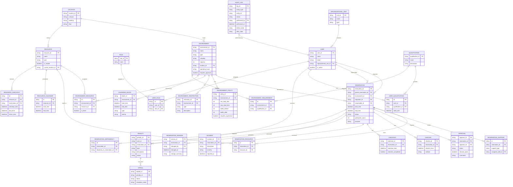

```mermaid
erDiagram

%% =========================
%% CORE ENTITIES
%% =========================

USER {
  string user_id PK
  string name
  string email
  string organizational_unit_id FK
  boolean is_active
}

ROLE {
  string role_id PK
  string name
}

USER_ROLE {
  string id PK
  string user_id FK
  string role_id FK
}

ORGANIZATIONAL_UNIT {
  string unit_id PK
  string name
  string type
}

ENVIRONMENT {
  string environment_id PK
  string name
  string type
  string criticality
  int capacity
  string location_id FK
  string operating_hours
  boolean requires_approval
}

LOCATION {
  string location_id PK
  string campus
  string building
  string floor
}

RESOURCE {
  string resource_id PK
  string name
  string type
  boolean is_mobile
  string current_location_id FK
}

%% =========================
%% ENVIRONMENT CONFIGURATION
%% =========================

ENVIRONMENT_POLICY {
  string policy_id PK
  string environment_id FK
  int min_lead_time
  int max_lead_time
  int buffer_before
  int buffer_after
  boolean requires_supervisor
}

ENVIRONMENT_RESTRICTION {
  string restriction_id PK
  string environment_id FK
  string type
  string description
}

ENVIRONMENT_RESOURCE {
  string id PK
  string environment_id FK
  string resource_id FK
  boolean is_fixed
}

%% =========================
%% RESERVATION CORE
%% =========================

RESERVATION {
  string reservation_id PK
  string parent_reservation_id FK
  string environment_id FK
  string requester_id FK
  string responsible_id FK
  datetime start_time
  datetime end_time
  string status
  int participant_count
  string purpose
}

RESERVATION_DEPENDENCY {
  string id PK
  string reservation_id FK
  string depends_on_reservation_id FK
}

RESERVATION_RESOURCE {
  string id PK
  string reservation_id FK
  string resource_id FK
}

RESERVATION_SUPPORT {
  string id PK
  string reservation_id FK
  string support_type
  string assigned_staff_id FK
}

%% =========================
%% AVAILABILITY & CALENDAR
%% =========================

CALENDAR_BLOCK {
  string block_id PK
  string environment_id FK
  datetime start_time
  datetime end_time
  string type
  string priority
}

RESOURCE_CALENDAR {
  string id PK
  string resource_id FK
  datetime start_time
  datetime end_time
}

%% =========================
%% AUTHORIZATION & ELIGIBILITY
%% =========================

QUALIFICATION {
  string qualification_id PK
  string name
  string description
}

USER_QUALIFICATION {
  string id PK
  string user_id FK
  string qualification_id FK
  datetime valid_until
}

ENVIRONMENT_REQUIREMENT {
  string id PK
  string environment_id FK
  string qualification_id FK
}

APPROVAL {
  string approval_id PK
  string reservation_id FK
  string approver_id FK
  string status
  datetime decision_date
  string comments
}

%% =========================
%% USAGE & OPERATIONS
%% =========================

CHECKIN {
  string checkin_id PK
  string reservation_id FK
  datetime checkin_time
  string method
}

CHECKOUT {
  string checkout_id PK
  string reservation_id FK
  datetime checkout_time
  boolean checklist_completed
}

INCIDENT {
  string incident_id PK
  string reservation_id FK
  string description
  string severity
  datetime reported_at
}

RESOURCE_CHECKOUT {
  string id PK
  string resource_id FK
  string reservation_id FK
  datetime checkout_time
  datetime due_time
  datetime return_time
}

%% =========================
%% PENALTIES & GOVERNANCE
%% =========================

PENALTY {
  string penalty_id PK
  string user_id FK
  string reservation_id FK
  string type
  string description
  string status
}

APPEAL {
  string appeal_id PK
  string penalty_id FK
  string status
  string resolution_notes
}

%% =========================
%% AUDIT & VERSIONING
%% =========================

RESERVATION_VERSION {
  string version_id PK
  string reservation_id FK
  string changed_by FK
  datetime changed_at
  string change_summary
}

AUDIT_LOG {
  string log_id PK
  string entity_type
  string entity_id
  string action
  string performed_by FK
  datetime performed_at
  string before_state
  string after_state
}

%% =========================
%% RELATIONSHIPS
%% =========================

USER ||--o{ RESERVATION : "requests"
USER ||--o{ RESERVATION : "responsible"
USER ||--o{ USER_QUALIFICATION : "has"
USER ||--o{ PENALTY : "receives"
USER ||--o{ USER_ROLE : "assigned"

ROLE ||--o{ USER_ROLE : "mapped_to"

ORGANIZATIONAL_UNIT ||--o{ USER : "contains"

ENVIRONMENT ||--o{ RESERVATION : "allocated_to"
ENVIRONMENT ||--o{ ENVIRONMENT_POLICY : "has"
ENVIRONMENT ||--o{ ENVIRONMENT_RESTRICTION : "has"
ENVIRONMENT ||--o{ ENVIRONMENT_RESOURCE : "contains"
ENVIRONMENT ||--o{ CALENDAR_BLOCK : "blocked_by"
ENVIRONMENT ||--o{ ENVIRONMENT_REQUIREMENT : "requires"

LOCATION ||--o{ ENVIRONMENT : "hosts"
LOCATION ||--o{ RESOURCE : "stores"

RESOURCE ||--o{ ENVIRONMENT_RESOURCE : "assigned"
RESOURCE ||--o{ RESERVATION_RESOURCE : "used_in"
RESOURCE ||--o{ RESOURCE_CALENDAR : "scheduled"
RESOURCE ||--o{ RESOURCE_CHECKOUT : "tracked"

RESERVATION ||--o{ RESERVATION_RESOURCE : "uses"
RESERVATION ||--o{ RESERVATION_SUPPORT : "needs"
RESERVATION ||--o{ APPROVAL : "requires"
RESERVATION ||--o{ CHECKIN : "has"
RESERVATION ||--o{ CHECKOUT : "has"
RESERVATION ||--o{ INCIDENT : "produces"
RESERVATION ||--o{ PENALTY : "generates"
RESERVATION ||--o{ RESERVATION_VERSION : "versioned"
RESERVATION ||--o{ RESERVATION_DEPENDENCY : "depends"

QUALIFICATION ||--o{ USER_QUALIFICATION : "granted"
QUALIFICATION ||--o{ ENVIRONMENT_REQUIREMENT : "required_for"

PENALTY ||--o{ APPEAL : "can_have"

AUDIT_LOG }o--|| USER : "performed_by"
```
